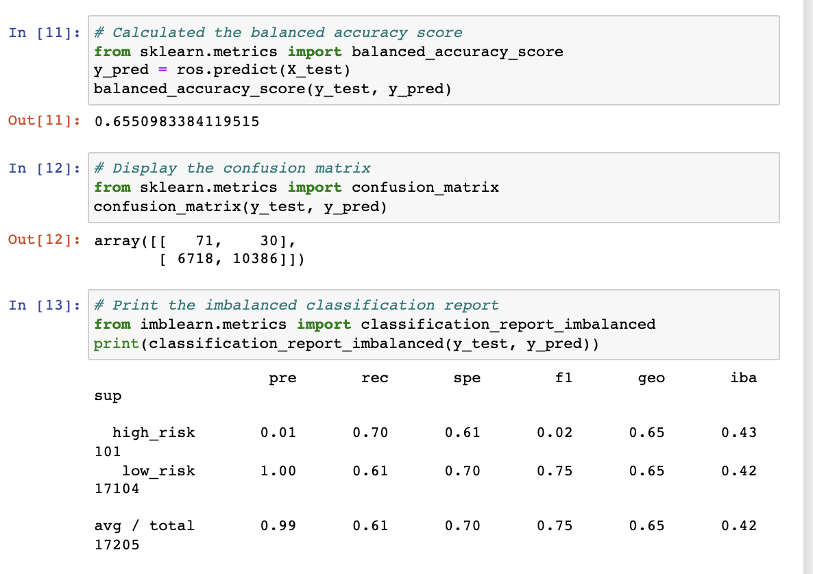
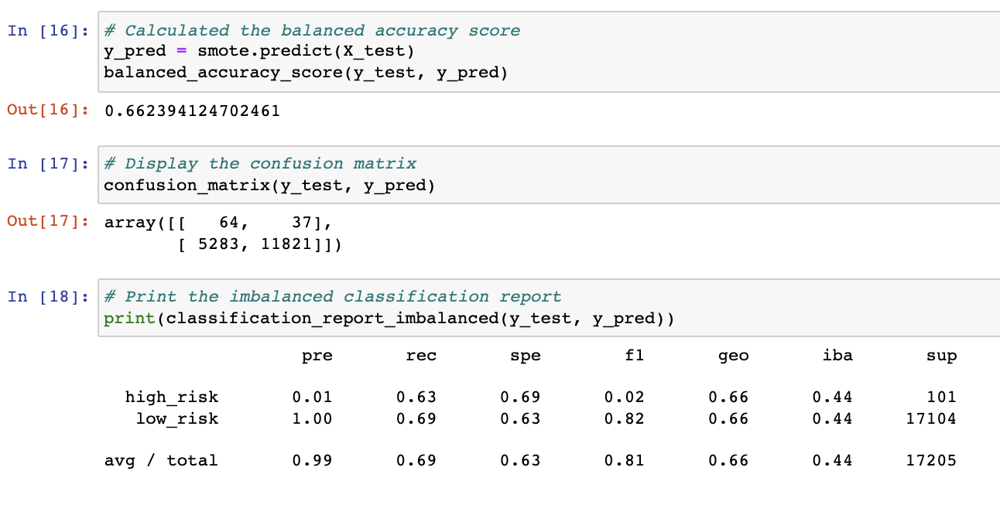
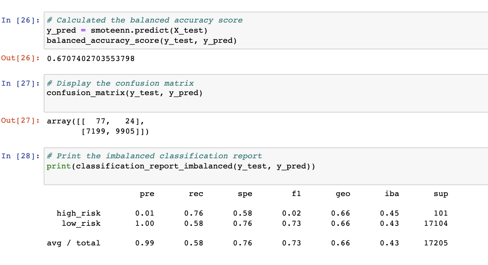

# Credit_Risk_Analysis

## Overview
Using the credit card credit dataset from LendingClub, a peer-to-peer lending services company, we’ll oversample the data using the RandomOverSampler and SMOTE algorithms, and undersample the data using the ClusterCentroids algorithm. Then, we’ll use a combinatorial approach of over- and undersampling using the SMOTEENN algorithm. Next, we’ll compare two new machine learning models that reduce bias, BalancedRandomForestClassifier and EasyEnsembleClassifier, to predict credit risk. Once we’re done, we’ll evaluate the performance of these models and make a written recommendation on whether they should be used to predict credit risk

## Results

- Native Random Oversampling

This above model shows that an accuracy test results of 65%, a precison score of 99% & recall scores are not that strong enough metrics to be relaible for predicting the credit risk.

- SMOTE Oversampling Results

The second model above shows that an accuracy test of 66%, a precision score of 99% & a recall score of 69%. The accuracy & recall scores are not strong enough metrics to be rliable in predicting credit risk.

- ClusterCentroids Undersampling Results
![])Resources/ClusterCentroid_Undersampling_Results.png)
The third model above shows that an accuracy test of 66%, a precision score of 99%, and a recall score of 69%. The accuracy & recall scores are not strong enough to be reliable for the prediction of credit risk.

- SMOTTEENN Combination Sampling Reuslts

The fourth model shows that the accuracy test of 67%, a precision score of 99% & a recall score of 76%. The accuracy & recall scores are not strong enough to be reliable for predicting the credit risk.

- Balanced Random Forest Classifier

The fifth model shows that the accuracy test of 79%, a precision score of 99% & a recall score of 87%. The accuracy & recall scores are higher than the othe previous four models above but are not strong to be reliable to predict the credit risk.

- Easy Ensemble AdaBoost Classifier

The sixth model shows us that the accuracy test score of 93%, a precision score of 99% & a recall score of 94%. The accuracy & recall scores are far more bettter than then the previous models & has a higher risk precision score.

## Summary

As we can see from all the models the best performer was the Easy Ensemble Classifier & the Balanced Random Forest Classifier. Both of these models are from the Ensemble category of classifier. We can see that the Eay Ensemble classifier model has higher risk precision score(0.09) & recall score of 94% for both high & low risk. So I would peresonally use or recommend the Easy Ensemble Classifier model. 
